# <center> How to Share Example Projects using cSolution </center>
## <center> 9/25/2023 </center>

This document captures the process to create a cSolution project from an existing eclipse based project.
The [cSolution examples and templates](https://github.com/Open-CMSIS-Pack/csolution-examples) provided by the Open-CMSIS-Pack group can also be referenced when getting started.  
The steps from these examples, when appropriate, will be referenced below.

## cSolution based on NXP LWIP Ping FreeRTOS Example
The introduction of Open-CMSIS-Packs will simplify the customer experience.  The pack will properly setup the example with the required software.  The standard is supported for importing projects into NXP supported IDEs: ARM MDK, IAR EWARM and VS Code.

The following was how a cSolution version of this example was generated from a known working example provided for NXP MCUXpresso IDE eclipse tools.

### 1.0 cSolution Example Workspace
cSolution examples can be provided within an Open-CMSIS-Pack.  A consistent folder structure should be adopted to help people navigate the location of content within the pack examples.  
The following folder structure is created when following the process outlined in this document:
```yaml
CMSIS-PACK:
+---examples
|   +---1st_example
|       +---armgcc
|       |---board
|       |---doc
|       |---source
|       \---Temp
|   \---2nd_example
|       +---armgcc
|       |---board
|       |---doc
|       |---source
|       \---Temp
\---middleware
```
To get started, create a workspace with an /examples folder.  
Replace the "1st_example" folder with the name of the example being converted to a cSolution format.

### 2.0 Add Template Files: cSolution, cProject and cDefault
The process starts with putting required template files in the root of the individual example folder (Copied from example templates):
- **[csolution.yml](https://github.com/Open-CMSIS-Pack/csolution-examples/blob/main/Templates/Simple/MyName.csolution.yml)**: contains target types, and packs for device, board and middleware
- **[cproject.yml](https://github.com/Open-CMSIS-Pack/csolution-examples/blob/main/Templates/Simple/MyName.cproject.yml)** : contains list of software components from packs and defines source files
- **[cdefault.yml](cdefault.yml)** : contains list of tool settings for different compilers

These files are updated to include information to describe the project.  
The filenames for csolution and cproject can be changed to be:
- examplename.csolution.yml
- examplename.cproject.yml

The files have general description fields that can be updated for the given example.
---

### 3.0 Gather Project Information
Having a working project provides a resource for gathering the required information for creating a cSolution project.  The information can be viewed in the UI of the MCUXpresso IDE, or copied from the Eclipse .cproject file.

#### 3.1 Defined Symbols
The Eclipse .cproject file has a section that lists all of the MCU C Compiler defined Symbols.  Open the .cproject file found in the root folder of the working Eclipse project.  Search for "Defined Symbols" to jump to the start an organized list of the defined symbols.  


Copy the list of values into the new cSolution project.  The values are pasted in the cProject.yml file under defines:  
The cSolution schema requires that the equal '=' characters are replaced with colon ':' characters.   
The Defined Symbols in the cProject.yml file should resemble the following:  
```yaml
  define:
    - __NEWLIB__
    - CPU_MIMXRT1062DVL6A
    - CPU_MIMXRT1062DVL6A_cm7
    - FSL_FEATURE_PHYKSZ8081_USE_RMII50M_MODE
    - _POSIX_SOURCE
    - SDK_DEBUGCONSOLE : 1
    - XIP_EXTERNAL_FLASH : 1
    - XIP_BOOT_HEADER_ENABLE : 1
    - USE_RTOS : 1
    - PRINTF_ADVANCED_ENABLE : 1
    - LWIP_DISABLE_PBUF_POOL_SIZE_SANITY_CHECKS : 1
    - SERIAL_PORT_TYPE_UART : 1
    - SDK_OS_FREE_RTOS
    - MCUXPRESSO_SDK
    - CR_INTEGER_PRINTF
    - PRINTF_FLOAT_ENABLE : 0
    - __MCUXPRESSO
    - __USE_CMSIS
    - DEBUG
```
#### 3.2 Linker Options
The Eclipse .cproject file has a section that lists all the optional Linker flags.  Search for "c.link.option.other" to jump to the start of the listed values.

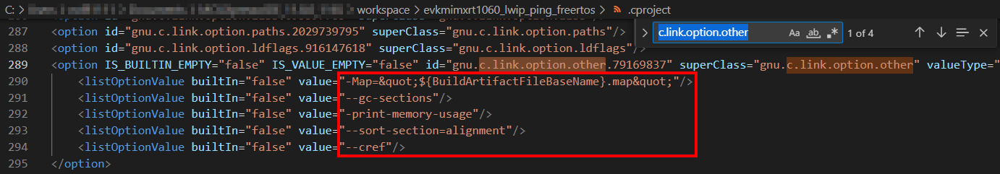

These linker values are copied and pasted into the new cDefault.yml file.  This file allows linker settings to be set as default for different build tools across all projects.  
Some of the linker values require a prefix to run properly by the cBuild tools.  Add a -Wl before the captured flags.  The flags for this project are shown below:  
```yaml
      Link:
        - -Wl,--gc-sections
        - -Wl,-print-memory-usage
        - -Wl,--sort-section=alignment
        #- -Map=&quot;${BuildArtifactFileBaseName}.map&quot;
        #- -Wl,--cref
```
>__NOTE__: The -Map and --cref flags are not used with the cBuild tools.  They are included but commented out.

#### 3.3 Compiler and Assembler Options
The settings for the Compiler and Assembler are easier to extract using the Project Settings UI in MCUXpresso IDE.
Access the settings under Project Explorer, right click on the desired project and select Properties.  
Click on C/C++ Build option in the left pane of the properties window.  
Then click on Settings to display and copy the Tool Settings for the Compiler, Assembler and Linker.  

Compiler options can be copied as shown in the following image:  
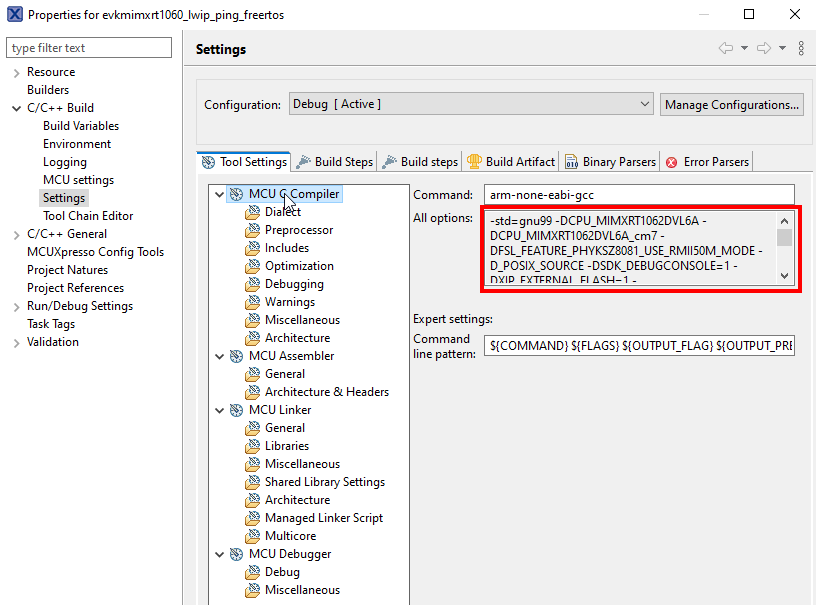  
The extracted compiler options can be cleaned up by removing prefixes and eliminating the -I and -D options handled by Paths and Defines.
```yaml
    - for-compiler: GCC
      C:
        - -std=gnu99 
        - -O0 
        - -fno-common 
        - -g3 
        # - -c 
        - -ffunction-sections 
        - -fdata-sections 
        - -ffreestanding 
        - -fno-builtin 
        # - -fmacro-prefix-map="$(<D)/"= 
        - -mcpu=cortex-m7 
        - -mfpu=fpv5-d16 
        - -mfloat-abi=hard 
        - -mthumb 
        - -fstack-usage
```

Assembler options can be copied as shown in the following image:  


The -I include and -D symbol defines can be removed.  The resulting Assembly options for the example project are:  
```yaml
      ASM:
        - -c 
        - -x assembler-with-cpp 
        - -g3 
        - -mcpu=cortex-m7 
        - -mfpu=fpv5-d16 
        - -mfloat-abi=hard 
        - -mthumb 
```
---

### 4.0 Updating the cSolution File
The device and board information can be found from the existing MCUXpresso Eclipse project.


The csolution is updated to specify packs required to support the device and board:  
- Board = EVK-IMXRT1060
- Device = MIMXRT1062xxxxA

NXP provides Board Support Packs with a '_BSP' suffix.  
NXP provides Device Support Packs with a "_DFP' suffix.  
Packs are listed with NXP as the first value to indicate the vendor. 

``` yaml
packs:
- pack: NXP::EVK-IMXRT1060_BSP
- pack: NXP::MIMXRT1062_DFP
```

The cSolution file also details the target and build types for the project.  
The **target-types** provide a unique identifier to distinguish between projects for different devices, boards and/or compilers.  This requires the target device to be listed with the package value.  
The **build-types** are typically Debug and Release versions of the same project.  Changing the debug components and the build optimizations.  
The **projects** lists the projects for the specified targets and builds.  
For this new cSolution example project adding the desired target and build types to the cSolution file should look like the following:
``` yaml
  target-types:
  - type: EVK-RT1060
    device: NXP::MIMXRT1062DVL6A
    # board: NXP::EVK-IMXRT1060
    compiler: GCC

  build-types:
  - type: debug
    debug: on       # puts compiler in -g3 mode
    optimize: none

  - type: Release 
    debug: off
    optimize: balanced

  projects:
  - project: example.cproject.yml
```

---

### 5.0 Updating the cProject File
The cproject.yml file required for the cSolution example format must be updated to include source files and software components.  

#### 5.1 Adding Source Files
Source files are added to the project under the groups: category.  
These files are provided in the pack under the /example/source folder.  
The given Eclipse example clearly lists the source files.  
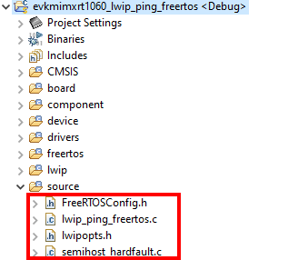

They are added to the new cProject.yml as follows:
```yaml 
  groups:
    - group: source
      files:
        - file: ./source/FreeRTOSConfig.h
        - file: ./source/lwip_ping_freertos.c
        - file: ./source/lwipopts.h
        - file: ./source/semihost_hardfault.h
```
The location of the source files must also be added to the cProject.yml under the paths: group
```yaml
  add-path:
    - ./source
```
***The source files for your example should be copied to the /source folder in the workspace.***

#### 5.2 Adding Board Files
Board files are another set of files that need to be added to the cProject.yml.    
Similar to the source files, they are provided in the pack under the /example/board folder.  
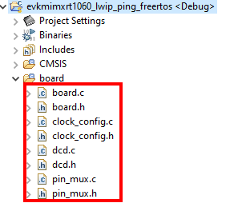

They are added to the cProject.yml as follows:
```yaml
    - group: board
      files:
        - file: board/pin_mux.c
        - file: board/pin_mux.h
        - file: board/board.c
        - file: board/board.h
        - file: board/clock_config.c
        - file: board/clock_config.h
        - file: board/dcd.c
        - file: board/dcd.h
```
The location of the board files must also be added to the cProject.yml under the paths: group
```yaml
  add-path:
    - ./source
    - ./board
```
***The board files for your example should be copied to the /board folder in the workspace.***

#### 5.3 Providing Linker Files for Project
This cSolution project requires linker files. The cProject.yml file identifies the files required for the different toolchains.  
This example needs to provide the linker files for the armgcc tools. (MCUXpresso VS Code tool support)  
The example can be expanded to provide support for other IDES.  They may require different sources to support different linker tools.

These files can be found in the working Eclipse project.  
They are generated and stored in the different build folders shown in the Project Explorer. (i.e. Typically /Debug and /Release)  

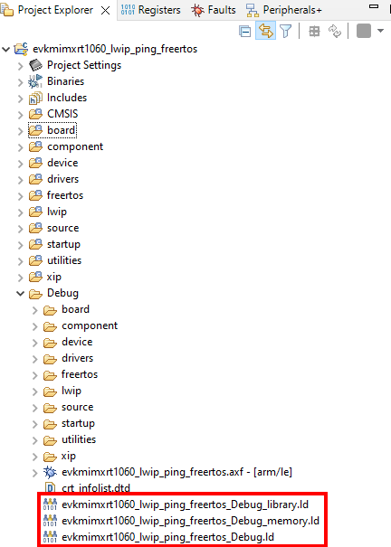  

There are three files for each build configuration that need to be copied into the pack in /example/armgcc folder.  

The primary linker file is added to the top of the cProject file:
```yaml
  linker:
    - script: evkmimxrt1060_lwip_ping_freertos_Debug.ld
      for-compiler: GCC
      for-context:
        - ".debug"
    - script: evkmimxrt1060_lwip_ping_freertos_Release.ld
      for-compiler: GCC
      for-context:
        - ".Release"        
```
The location of the linker files must also be added to the cProject.yml under the paths: group  
```yaml
  add-path:
    - ./source
    - ./board
    - ./armgcc    
```

The primary file _Debug.ld is generated with INCLUDE statements for the _library and _memory files.  
These INCLUDE statements must be commented out or deleted.  These two linker files are added with Linker flag options in the cDefault.yml file.
The following shows how the additional linker scripts for Debug and Release build configurations are included in the cDefault.yml.  
```yaml
      Link:
        - -nostdlib     #No startup or default libs

        - -Wl,--gc-sections
        - -Wl,-print-memory-usage
        - -Wl,--sort-section=alignment
        - -T./armgcc/evkmimxrt1060_lwip_ping_freertos_Debug_library.ld
        - -T./armgcc/evkmimxrt1060_lwip_ping_freertos_Debug_memory.ld 
        - -T./armgcc/evkmimxrt1060_lwip_ping_freertos_Release_library.ld
        - -T./armgcc/evkmimxrt1060_lwip_ping_freertos_Release_memory.ld      
```
***The linker files for your example should be copied to the /armgcc folder in the workspace.***


#### 5.4 Adding Project Specific Packs 
The cProject file can add additional packs for the tools to use for a given project.  They can be the same list of packs as listed in the cSolution or contain additional packs or be used to specify a particular version to be used.  
For the example project, the application and title indicate some of the additional required packs.  
- **CMSIS** : The NXP microcontroller family is built on CMSIS standard products.  The CMSIS library of drivers are used by the NXP projects.  A CMSIS folder is listed in the Project Explorer view of our example project.  This pack provides those files. 
- **lwip** : lwip is an open source software.  NXP provides a pack that contains some modifications specific to NXP microcontrollers.  There is another lwip pack provided by ARM.  The author should verify that the correct lwip pack is being used to deliver the necesary files.  
- **FreeRTOS** : NXP provides a pack to support FreeRTOS kernel operations.  There are other FreeRTOS packs, so the auther must specify that the NXP pack is used.

These packs are added to the cProject.yml as follows:
```yaml
  packs:
    - pack: NXP::MIMXRT1062_DFP
    - pack: NXP::EVK-IMXRT1060_BSP
    - pack: ARM::CMSIS
    - pack: NXP::LWIP
    - pack: NXP::FREERTOS-KERNEL  
```
#### 5.5 Specifying Software Components from Packs
Adding software components is the most involved process in migrating a project to the cSolution format.  The libraries and source files must be captured in the cSolution lists.  Another complexity is to verify that the correct source and version of the library is being provided by the pack.  
The cSolution requires the components are identified by the following values:
```yaml
- component: Device:Startup&Baremetal
- component: Cclass:Cgroup:Csub&Cvariant
```
A device specific software component can be specified by using the first value **Device**.  The CMSIS tools replace Device with the value defined by the cSolution target.  These software components are found in the corresponding Device Family Pack (DFP).  

A generic software component can be specified by a **Cclass** and **Cgroup**.  This allows software components to be organized by a taxonomy.  This can help organize common software components.  
But how do you determine the correct values?

##### Eclipse Project Explorer
If the project exists in Eclipse format, you can use the Eclipse Project Explorer view to identify most of the component names.
NXP has kept a consistent naming convention between file names and software components.  The following image shows an example of the location and a few of the component names.


This first pass of the project helps the author add the following components to the cProject file.  They are grouped by the associated folders found in the eclipse project.
``` yaml
  components:
    - component: ARM::CMSIS:CORE@5.6.0
    - component: Device:Startup
    - component: NXP::Device:CMSIS:MIMXRT1062_system
    - component: NXP::Device:CMSIS:MIMXRT1062_header
    - component: NXP::Board Support:SDK Drivers:evkimxrt1060

    # Component
    - component: NXP::Device:SDK Drivers:lists
    - component: NXP::Device:SDK Drivers:phy-common
    - component: NXP::Device:SDK Drivers:phy-device-ksz8081 
    - component: NXP::Device:SDK Utilities:serial_manager
    - component: NXP::Device:SDK Utilities:serial_manager_uart
    - component: NXP::Device:SDK Drivers:lpuart_adapter
    # Drivers
    - component: NXP::Device:SDK Drivers:cache
    - component: NXP::Device:SDK Drivers:clock
    - component: NXP::Device:SDK Drivers:common
    - component: NXP::Device:SDK Drivers:enet
    - component: NXP::Device:SDK Drivers:gpio
    - component: NXP::Device:SDK Drivers:iomuxc
    - component: NXP::Device:SDK Drivers:lpuart
    # FreeRTOS
    - component: NXP::RTOS&FreeRTOS NXP:Core
    - component: NXP::RTOS&FreeRTOS NXP:freertos template
    - component: NXP::RTOS&FreeRTOS NXP:TAD extension
    - component: NXP::RTOS&FreeRTOS NXP:Heap&Heap_4
    # LWIP

    # Utilities
    - component: NXP::Device:SDK Utilities:assert
    - component: NXP::Device:SDK Utilities:debug_console
    - component: NXP::Device:SDK Utilities:str
```

Notice that no LWIP components are added.  This is an example of where a software component can not be determined from existing information.  The CMSIS Tools provide a way to determine what components are available from the included packs.

```yaml
C:\ csolution list components .\example.csolution.yml
```
This will provide a useful list that the author can reference when populating the necesary software components:

These lwip components are added to the cProject to provide the necesary files.

##### Pack and Component Dependencies
Once the cProject has an initial list of components, the cbuild tool can be used to verify the correct names were used.  The tool output will also identify any co-dependencies that a component or pack may have.  These can be added to the cProject list to remove the notifications.

The cProject and cSolution files need to be built using the CMSIS-Toolbox tools.  
Before the cBuild tool can work with the project, you must convert the cSolution.yml  
This generates the necesary risudual files/folders (RSE) for cBuild tools to run.
```yaml
c:\..\csolution convert example.csolution.yml
```
After this is run, the cbuild commands can be used to verify the cSolution and cProject syntax and content.
```yaml
c:\..\cbuild example.csolution.yml
```

The first error shows that "No such file or directory" exists for fsl_silicon_id.h.  
This can be used with the csolution list components to locate any missing files.
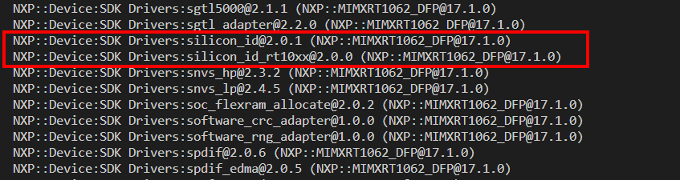
This component is added to cProject component list.  
```yaml
    - component: NXP::Device:SDK Drivers:silicon_id
    - component: NXP::Device:SDK Drivers:silicon_id_rt10xx
```
This process can be repeated until no errors are reported for missing files.

FreeRTOS Heap level must also be set by the software component.
The Heap component can be found in freertos/freertos-kernel/portable/MemMang folder in the working project.  Heap_3 is used in the working project.  This should be added to the included components
```yaml
    - component: NXP::RTOS&FreeRTOS NXP:Heap&Heap_3
```
### 6.0 Include cSolution Project in Pack
The working cSolution project can be added to a CMSIS-Pack for easy delivery to customers evaluating the included software.  
The cSolution will load an example project into the customers IDE.  The packs and code can be reviewed before the customer adds the software component to a new custom project.  
The following steps are followed to have the examples included in a pack description file (.pdsc).  

```cpp
  <examples>
    <example name="lwip_test" folder="examples/Memfault-https-cli" doc="doc/readme.txt">
      <description>Default example without Memfault additions.</description>
      <board name="EVKB-IMXRT1050" vendor="NXP" Dvendor="NXP:11"/>
      <project>
        <environment name="csolution" load="examples/Memfault-https-cli/lwip_httpscli_mbedTLS_freertos.csolution.yml"/>
      </project>
      <attributes/>
    </example>
    <example name="NXP_Ping_test" folder="examples/NXP-ping" doc="doc/readme.txt">
      <description>Default Ping example.</description>
      <board name="EVK-MIMXRT1060" vendor="NXP" Dvendor="NXP:11"/>
      <project>
        <environment name="csolution" load="examples/NXP-ping/example.csolution.yml"/>
      </project>
      <attributes/>
    </example>    
    <example name="NXP_FreeRTOS_Sem" folder="examples/NXP-freesrtos-sem" doc="doc/readme.txt">
      <description>Default FreeRTOS Sempaphore example.</description>
      <board name="EVK-MIMXRT1060" vendor="NXP" Dvendor="NXP:11"/>
      <project>
        <environment name="csolution" load="examples/NXP-freesrtos-sem/freertos-sem.csolution.yml"/>
      </project>
      <attributes/>
    </example>        
  </examples>
```

------

### 6.0 Add Software Not Available in Packs
The lwip source referenced in the example requires an older version of the source.  This source can be included by adding the code to the pack folder and including the folder in the project path.
The files must be copied from the valid working project and placed in a folder /lwip within the pack /example/lwip.  
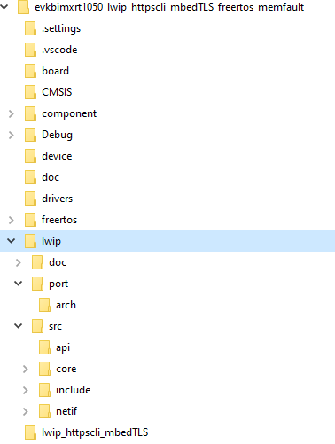

The cProject allows the build tools to search the included folder by adding to a list of paths.
```yaml
  add-path:
    - ./source
    - ./lwip/port
    - ./lwip/port/arch
    - ./lwip/src
    - ./lwip/src/include
    - ./lwip/src/include/compat
    - ./lwip/src/core
    - ./lwip/src/core/ipv6
    - ./lwip/src/include/lwip/priv
```
These files should be accesible to the user as project files.
That requires that the files be listed as source and header files under the groups category.

The following is added to the cProject under the groups category to allow the required lwip files to be added as source and header files.  **lwip-src** is the selected group name chosen by the author for the associated files.
```yaml
    - group: lwip-src
      files:
        - file: ./lwip/src/api/api_lib.c
        - file: ./lwip/src/api/api_msg.c
        - file: ./lwip/src/api/err.c
        - file: ./lwip/src/api/if_api.c
        - file: ./lwip/src/api/netbuf.c
        - file: ./lwip/src/api/netdb.c
        - file: ./lwip/src/api/netifapi.c
        - file: ./lwip/src/api/sockets.c
        - file: ./lwip/src/api/tcpip.c

        - file: ./lwip/src/core/altcp_alloc.c
        - file: ./lwip/src/core/altcp_tcp.c
        - file: ./lwip/src/core/altcp.c
        - file: ./lwip/src/core/def.c
        - file: ./lwip/src/core/dns.c
        - file: ./lwip/src/core/inet_chksum.c
        - file: ./lwip/src/core/init.c
        - file: ./lwip/src/core/ip.c
        - file: ./lwip/src/core/mem.c
        - file: ./lwip/src/core/memp.c
        - file: ./lwip/src/core/netif.c
        - file: ./lwip/src/core/pbuf.c
        - file: ./lwip/src/core/raw.c
        - file: ./lwip/src/core/stats.c
        - file: ./lwip/src/core/sys.c
        - file: ./lwip/src/core/tcp_in.c
        - file: ./lwip/src/core/tcp_out.c
        - file: ./lwip/src/core/tcp.c
        - file: ./lwip/src/core/timeouts.c
        - file: ./lwip/src/core/udp.c

        - file: ./lwip/src/core/ipv4/acd.c
        - file: ./lwip/src/core/ipv4/autoip.c
        - file: ./lwip/src/core/ipv4/dhcp.c
        - file: ./lwip/src/core/ipv4/etharp.c
        - file: ./lwip/src/core/ipv4/icmp.c
        - file: ./lwip/src/core/ipv4/igmp.c
        - file: ./lwip/src/core/ipv4/ip4_addr.c
        - file: ./lwip/src/core/ipv4/ip4_frag.c
        - file: ./lwip/src/core/ipv4/ip4.c

        - file: ./lwip/src/core/ipv6/dhcp6.c
        - file: ./lwip/src/core/ipv6/ethip6.c
        - file: ./lwip/src/core/ipv6/icmp6.c
        - file: ./lwip/src/core/ipv6/inet6.c
        - file: ./lwip/src/core/ipv6/ip6_addr.c
        - file: ./lwip/src/core/ipv6/ip6_frag.c
        - file: ./lwip/src/core/ipv6/ip6.c
        - file: ./lwip/src/core/ipv6/mld6.c
        - file: ./lwip/src/core/ipv6/nd6.c

        - file: ./lwip/src/netif/ppp/auth.c
        - file: ./lwip/src/netif/ppp/ccp.c
        - file: ./lwip/src/netif/ppp/chap-md5.c
        - file: ./lwip/src/netif/ppp/chap_ms.c
        - file: ./lwip/src/netif/ppp/demand.c
        - file: ./lwip/src/netif/ppp/eap.c
        - file: ./lwip/src/netif/ppp/eui64.c
        - file: ./lwip/src/netif/ppp/fsm.c
        - file: ./lwip/src/netif/ppp/ipcp.c
        - file: ./lwip/src/netif/ppp/ipv6cp.c
        - file: ./lwip/src/netif/ppp/lcp.c
        - file: ./lwip/src/netif/ppp/lwip_ecp.c
        - file: ./lwip/src/netif/ppp/magic.c
        - file: ./lwip/src/netif/ppp/mppe.c
        - file: ./lwip/src/netif/ppp/multilink.c
        - file: ./lwip/src/netif/ppp/ppp.c
        - file: ./lwip/src/netif/ppp/pppapi.c
        - file: ./lwip/src/netif/ppp/pppcrypt.c
        - file: ./lwip/src/netif/ppp/pppoe.c
        - file: ./lwip/src/netif/ppp/pppol2tp.c
        - file: ./lwip/src/netif/ppp/pppos.c
        - file: ./lwip/src/netif/ppp/upap.c
        - file: ./lwip/src/netif/ppp/utils.c
        - file: ./lwip/src/netif/ppp/vj.c

        - file: ./lwip/src/netif/bridgeif.c
        - file: ./lwip/src/netif/bridgeif_fdb.c
        - file: ./lwip/src/netif/ethernet.c
        - file: ./lwip/src/netif/lowpan6.c
        - file: ./lwip/src/netif/lowpan6_ble.c
        - file: ./lwip/src/netif/lowpan6_common.c
        - file: ./lwip/src/netif/slipif.c
        - file: ./lwip/src/netif/zepif.c

        - file: ./lwip/port/enet_ethernetif.c
        - file: ./lwip/port/enet_ethernetif_kinetis.c
        - file: ./lwip/port/sys_arch.c
  ```
The author is able to add non-pack software to a project by copying the required source files into a folder, adding the folders to the path, and listing the necesary files.

In addition to the lwip library files, there are 2 lwip configuration files included in a folder /lwip_httpscli_mbedTLS.  For simplicity, these 2 files were copied over into the /examples/source folder.  

##### Adding the remaining missing components
The same process is followed to identify and add the remaining software components.
The following are the errors with their corresponding pack components:
```yaml
"fsl_debug_console.h": No such file or directory    ==>   NXP::Device:SDK Utilities:debug_console  

"fsl_component_serial_manager.h": No such file or directory   ==>   NXP::Device:SDK Utilities:serial_manager

mbedtls/entropy.h: No such file or directory     ==>    - pack: NXP::MBEDTLS
mbedtls/entropy.h: No such file or directory     ==>    - component: NXP::Security&Mbed_TLS:mbedTLS library:template
mbedtls/entropy.h: No such file or directory     ==>    - component: NXP::Security&Mbed_TLS:mbedTLS library:ksdk
mbedtls/entropy.h: No such file or directory     ==>    - component: NXP::Security&Mbed_TLS:mbedTLS library:mbedtls 


#error SERIAL_PORT_TYPE_UART      ==>   shows that a #define is required for debug_console
#error SERIAL_PORT_TYPE_UART      ==>   The project definitions can be taken from the eclipse project settings
#error SERIAL_PORT_TYPE_UART      ==>   The settings include - SERIAL_PORT_TYPE_UART : 1

```

When adding the lwIP components, the csolution convert will mention that a component is required for the Device:SDK Drivers:phy-common

When adding the debug_console component, the cbuild output has an error related to the SERIAL_PORT_TYPE definitions.  The Eclipse project can be used to extract the required project global definitions.  
The definitions are added to the cProject under the category of **define:**  
The following are all of the global definitions pulled from the eclipse project:  
```yaml
  define:
    # Moved to global Defines for this cProject
    - CPU_MIMXRT1052DVL68
    - CPU_MIMXRT1052DVL68_cm7
    - _POSIX_SOURCE
    - XIP_BOOT_HEADER_DCD_ENABLE : 1
    - SKIP_SYSCLK_INIT
    - DATA_SECTION_IS_CACHEABLE : 1
    - SDK_DEBUGCONSOLE : 1
    - XIP_EXTERNAL_FLASH : 1
    - XIP_BOOT_HEADER_ENABLE : 1
    - FSL_FEATURE_PHYKSZ8081_USERMII50M_MODE
    - FSL_SDK_ENABLE_DRIVER_CACHE_CONTROL : 1
    - PRINTF_ADVANCED_ENABLE : 1
    - USE_RTOS : 1
    - LWIP_DNS : 1
    - LWIP_DHCP : 1
    - MBEDTLS_CONFIG_FILE: \"mbedtls_config_client.h\"
    - ENET_RXBUFF_NUM : 14
    - LWIP_DISABLE_PBUF_POOL_SIZE_SANITY_CHECKS : 1
    - SERIAL_PORT_TYPE_UART : 1
    - SDK_OS_FREE_RTOS
    - MCUXPRESSO_SDK
    - CR_INTEGER_PRINTF
    - __MCUXPRESSO
    - __USE_CMSIS
    - DEBUG
    - __NEWLIB__
```

After adding defines, the missing files continue:

```yaml
fsl_adapter_uart.h: No such file or directory   ==>       NXP::Device:SDK Drivers:lpuart_adapter
```
Note the difference in the naming convention for this component.
The way to discover the difference is to use the csolution command to list the available components.  You will see this listed as an available component:
```yaml
C:\ csolution list components .\example.csolution.yml

The following is found in the list of available components.

NXP::Device:SDK Drivers:lpuart_adapter@1.0.0 (NXP::MIMXRT1052_DFP@17.0.0)
```
After adding lpuart_adapter, the missing files continue:

```yaml
fatal error: pin_mux.h: No such file or directory
```
This error introduces the requirement to have the NXP board files.  These are all provided in the example project under the /board folder.
These should be copied into the /example/board folder and the path and files added to the cProject groups.

The new board group is added as follows:
```yaml
    - group: board
      files:
        - file: board/pin_mux.c
        - file: board/pin_mux.h
        - file: board/board.c
        - file: board/board.h
        - file: board/clock_config.c
        - file: board/clock_config.h
        - file: board/dcd.c
        - file: board/dcd.h
```

The process continues after board files are added:

```yaml
fatal error: fsl_phyksz8081.h: No such file or directory  ==>   NXP::Device:SDK Drivers:phy-device-ksz8081 

fatal error: fsl_enet_mdio.h: No such file or directory   ==>   NXP::Device:SDK Drivers:mdio-enet 
```

The mdio-enet driver is only found in an older version of the NXP SDK.  It was provided in the SDK that included the working example.  
This can be fixed by specifying that the pack use the Device Drivers from a prior release.  The one associated with SDK v2.10.0  
The Pack release notes identify which versions are related.  13.1.0 is shown as the Pack release that contains source from the v2.10.0 SDK

The packs at the top of the cProject and cSolution should be **restricted** to pull from the 13.1.0 release.  The following inforces this requirement:  
```yaml
  packs:
    - pack: NXP::MIMXRT1052_DFP@13.1.0
    - pack: NXP::EVKB-IMXRT1050_BSP@13.1.0
```
Once this is added, the csolution convert identifies that mdio-enet requires Device:SDK Drivers:mdio-common.
Also, csolution checks dependency and identifies the following dependencies:
```yaml
NXP::Device:SDK Utilities:serial_manager@1.0.1
  accept Device:SDK Utilities:serial_manager_swo
  accept Device:SDK Utilities:serial_manager_uart
  accept Device:SDK Utilities:serial_manager_virtual
```

After adding serial_manager components,
require Device:SDK Drivers:lists

At this point the cProject builds with all of the components required in the included source files.
The next step in the CMSIS cBuild Tool is the Linking process.

### cBuild Linking Process
The following section identifies the steps required to properly link a project

#### Adding Project Linker File
The cProject requires a linker file to be added to the list of requirements.

The linker file is specific for the armgcc build tools.  The file can be located in the Debug folder of the working Eclipse project.
The Memfault example project requires 3 linker files.

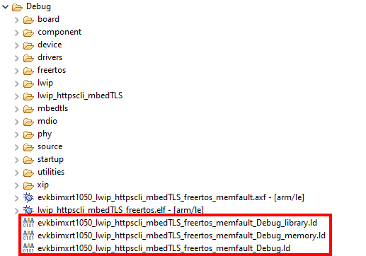

The primary linker file has the filename ending in **"...Debug.ld"**  
The other 2 linker files are listed in the primary file as includes.
These three file should be copied into an /examples/armgcc folder.

The files are then referenced in the cProject file using the path.
>__NOTE:__ The cProject Linker tool failed to take indirect paths.  To quickly resolve this issue I used absolute paths.  The Path issue can likely be resolved.

```yaml
  linker:
    - script: C:/GIT/Create-cSolution-Process/examples/armgcc/evkbimxrt1050_lwip_httpscli_mbedTLS_freertos_memfault_Debug.ld
      for-compiler: GCC
      for-context:
        - ".debug"
        - ".Release"
```

At this point the Linking process generates new errors based on undefined references to Freertos functions: 'pvPortMalloc', 'pvPortFree', 'vTaskDelete', 'vTaskList'.  

I practice cleaning the build artifacts when unexpected results occur.
```yaml
cbuild -C .\example.csolution.yml
```

### Add Flags for Project Build/Assemble/Link
I still had errors that were unexplained.  So I added the known Build, Assembly and Linker flags from the working Eclipse project.

These were added into a cDefault.yml file added to the same folder as the cProject and cSolution files.  The file allows the user to control the tool command parameters passed.

To get the proper flags, the Project Properties from Eclipse can be copied.
1st, copy "All Options" located under the C/C++ Build -- Settings window for the the MCU C Compiler Tool Settings:
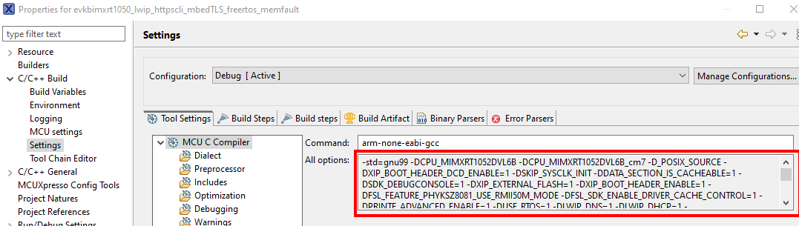

2nd, copy "All Options" located under the C/C++ Build -- Settings window for the the MCU Assembler Tool Settings:
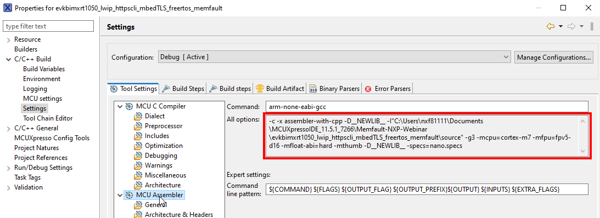

3rd, copy "All Options" located under the C/C++ Build -- Settings window for the the MCU Linker Tool Settings:
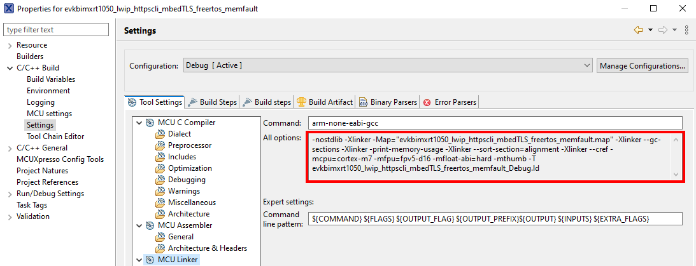

The values can be pasted into the cDefault file.  
Use the editor to remove the extra characters:  
-I : These are used in eclipse to specify paths.  The cProject file draws the paths from the included pack and the paths list.  
-Map : This defines the Map location.  This is replaced by the explicit linker files.

You should be left with a list of options that contain:  
-D : Define values can be added following this prefix  
-f : parameters for compiler  
-m : Cortex-M specific parameters  
-g : Debug verbosity.  g0 removes most debug content; g3 adds most debug content  
-c :  
-specs : identifies library used.  Newlib, Newlib.nano...  

Here are the values extracted from the Memfault example project.  (The defines were extracted in the same manner and pasted into the cProject file)  
They are added to the cDefault.yml file in the following list:  
```yaml
    - for-compiler: GCC
      C:
        - -std=gnu99
        - -O0 
        - -fno-common 
        - -g3
        - -fomit-frame-pointer 
        # - -c 
        - -ffunction-sections 
        - -fdata-sections 
        - -ffreestanding 
        - -fno-builtin 
        - -fmerge-constants 
        #- -fmacro-prefix-map="$(<D)/"= 
        - -mcpu=cortex-m7 
        - -mfpu=fpv5-d16 
        - -mfloat-abi=hard 
        - -mthumb 
        - -fstack-usage 
        - -specs=nano.specs
      ASM:
        - -c
        - -x assembler-with-cpp
        #- -I"$(<D)/"\source"
        - g3
        - -mcpu=cortex-m7
        - -mfpu=fpv5-d16
        - -mfloat-abi=hard
        - -mthumb 
        - -specs=nano.specs

      Link:
        - -nostdlib     #No startup or default libs
        - -Wl,--gc-sections 
        - -Wl,-print-memory-usage 
        - -Wl,--sort-section=alignment 
        # - -Wl,--cref 
        # - -Map="evkbimxrt1050_lwip_httpscli_mbedTLS_freertos_memfault.map"
        - -mcpu=cortex-m7 
        - -mfpu=fpv5-d16 
        - -mfloat-abi=hard 
        - -mthumb 
        #- -T evkbimxrt1050_lwip_httpscli_mbedTLS_freertos_memfault_Debug.ld

```

After the cDefault file is updated with tool options, the project cBuild completes and binary files are generated for the project.

----


##### components:
Missing components can be discovered using the CLI command
``` yaml
csolution projectname.csolution.yml
```
The output of this command identifies missing include files.  The missing include files can be resolved by adding the correct component from a pack.  The pack component name is often contains the **name** from the missing include file.  You can search for the name in the pack tools.  The tools will provide the result with required Cclass, Cgroup information.  That allows the component to be added to the list in cProject as:
``` yaml
components:
- component: Cclass:Cgroup:Csub&Cvariant
```
Here is an example of to resolve a missing component:


### 2.0 Add files from working project
We want to differentiate between files available from packs and those source files specific to the example.  These files are added to the cProject under files category.


### 3.0 Add additional Packs required for project
The project description and title indicate support is required for LWIP, mbedTLS, and FreeRTOS.  
NXP provides packs for these components.  They can be found by using a couple sources: 
- VS Code CMSIS extension.  Software Components view
- Eclipse CMSIS-Pack Manager Tool :  uVision, MCUXpresso IDE, IAR EWARM 
- [www.kiel.arm.com](https://www.keil.arm.com/) : able to search for Device, Board, and Software Packs

  
This is represented in the cSolution as


    


