# <center>Creating cSolution Projects based on Working NXP Examples</center>

This document captures a process to create a cSolution project from an existing MCUXpresso IDE eclipse based project.    
The Open-CMSIS-Pack group provides [cSolution examples and templates](https://github.com/Open-CMSIS-Pack/csolution-examples) that can also be referenced when getting started.  

The growing adoption of the Open-CMSIS-Pack standard is simplifying the embedded software development experience.  Open-CMSIS-Packs are supported by multiple IDEs to import example projects with the proper software and settings.  This provides developers a common software experience across ARM MDK, IAR EWARM and Microsoft VS Code.  

cSolution examples can be delivered within an Open-CMSIS-Pack.  Popular IDEs have pack management tools that highlight these examples to help customers evaluate the middleware in the Open-CMSIS-Pack.  

>__NOTE__ The /examples folder contains multiple examples created from this process.  
>The content in the [lwip-ping-freertos](./examples/lwip-ping-freertos/) is generated by the following steps.
> 
>The process requires a working MCUXpresso IDE project.
>The MCUXpresso IDE project must be built to generate the linker files required for each of the build configurations.

## 1.0 Example Workspace
A workspace folder should be created to store the cSolution example projects.
A consistent folder structure should be adopted to help organize the example content in a pack.  
The following folder structure is used for the process outlined in this document:

```yaml
CMSIS-PACK:
+---examples
|   +---2nd_example
|       +---armgcc
|       |---board
|       |---doc
|       \---source
|   \---2nd_example
|       +---armgcc
|       |---board
|       |---doc
|       \---source
\---middleware
```
>__ACTION:__
>To get started, create a workspace with an /examples base folder.  
>Replace the "1st_example" folder with the name of the example being converted to a cSolution format.

## 2.0 Project Template Files
The process starts with putting required template files in the root of the individual example folder (Copied from empty example templates):
- **[csolution.yml](https://github.com/Open-CMSIS-Pack/csolution-examples/blob/main/Templates/Simple/MyName.csolution.yml)**: contains target types, and packs for device, board and middleware
- **[cproject.yml](https://github.com/Open-CMSIS-Pack/csolution-examples/blob/main/Templates/Simple/MyName.cproject.yml)** : contains list of software components from packs and defines source files
- **[cdefault.yml](./examples/lwip-ping-freertos/cdefault.yml)** : contains list of tool settings for different compilers

These files are updated to include information that details the project.  

The filenames for csolution and cproject can be changed to be:
- examplename.csolution.yml
- examplename.cproject.yml

The cProject file has a project description that should be updated for the selected example.  
```yaml
project:
  description: Example Project that uses NXP i.MX RT1050 with lwip, FreeRTOS, and mbedtls to establish a secure http connection.
```
>__ACTION:__
>Update the cproject.yml file to include project description.  This can be found in the readme.txt included with MCUXpresso projects.

---

## 3.0 Gather Project Information
Having a pre-built working project in MCUXpresso IDE provides a resource for gathering the required information for creating a cSolution project.  The information can be viewed in the UI of the MCUXpresso IDE, or copied from the Eclipse .cproject file.  The settings collected below are specific to a single build configuration.  **The process must be repeated for each build configuration** (i.e. debug, release...)  The UI and .cproject file have different sections for each.

### 3.1 Defined Symbols
The MCUXpresso IDE eclipse .cproject file has a section that lists all of the MCU C Compiler defined Symbols.  Open the .cproject file found in the root folder of the working Eclipse project.  Search for "Defined Symbols" and jump to an organized list of the defined symbols.  

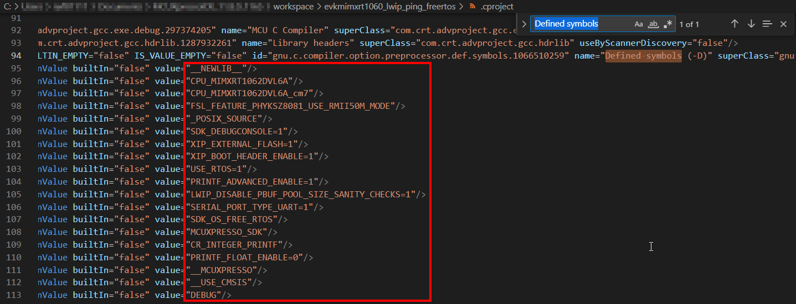

Copy the list of values into the cProject.yml file in the new cSolution project.  The values are pasted under defines:  
The cSolution schema requires that the equal '=' characters are replaced with colon ':' characters.   
The Defined Symbols in the cProject.yml file should resemble the following:  
```yaml
  define:
    - __NEWLIB__
    - CPU_MIMXRT1062DVL6A
    - CPU_MIMXRT1062DVL6A_cm7
    - FSL_FEATURE_PHYKSZ8081_USE_RMII50M_MODE
    - _POSIX_SOURCE
    - SDK_DEBUGCONSOLE : 1
    - XIP_EXTERNAL_FLASH : 1
    - XIP_BOOT_HEADER_ENABLE : 1
    - USE_RTOS : 1
    - PRINTF_ADVANCED_ENABLE : 1
    - LWIP_DISABLE_PBUF_POOL_SIZE_SANITY_CHECKS : 1
    - SERIAL_PORT_TYPE_UART : 1
    - SDK_OS_FREE_RTOS
    - MCUXPRESSO_SDK
    - CR_INTEGER_PRINTF
    - PRINTF_FLOAT_ENABLE : 0
    - __MCUXPRESSO
    - __USE_CMSIS
    - DEBUG
```
### 3.2 Linker Options
The MCUXpresso IDE eclipse .cproject file has a section that lists the included Linker options.  Search for "c.link.option.other" to jump to the start of the listed values.

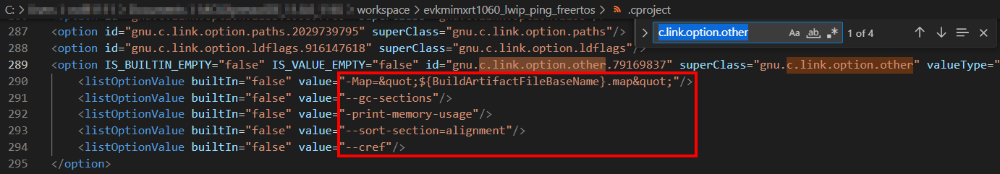

Copy the list of linker values into the cDefault.yml file in the new cSolution project.  This file specifies default tool settings for different build tools across all the included projects.  
Some of the linker values from eclipse require a prefix to run properly by the cBuild tools.  Add a -Wl before the captured flags.  
The Linker flags in the cDefault.yml file should resemble the following: 
```yaml
      Link:
        - -Wl,--gc-sections
        - -Wl,-print-memory-usage
        - -Wl,--sort-section=alignment
        #- -Map=&quot;${BuildArtifactFileBaseName}.map&quot;
        #- -Wl,--cref
```
>__NOTE__: The -Map and --cref flags are not used with the cBuild tools.  They are included but commented out.

### 3.3 Compiler and Assembler Options
The Compiler and Assembler options for a cSolution project are listed in the cDefault.yml.  
The settings for the Compiler and Assembler can be extracted using the Project Settings UI in MCUXpresso IDE.  

Access the settings under Project Explorer, right click on the desired project and select Properties.  
Click on C/C++ Build option in the left pane of the properties window.  
Then click on Settings to display and copy the Tool Settings for the Compiler, Assembler and Linker.  

Compiler options can be copied from the box highlighted in the following image:  
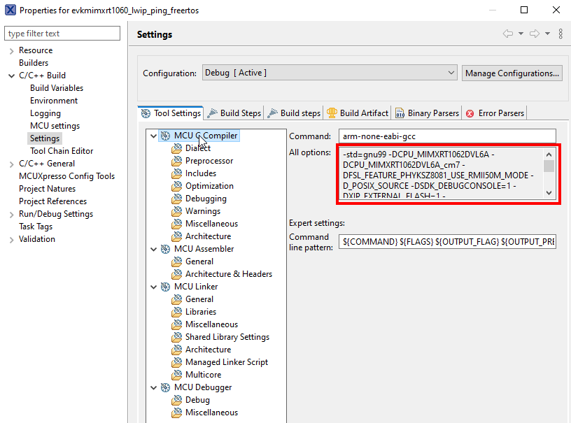  

The extracted compiler options can be cleaned up by removing prefixes and eliminating the -I and -D options handled elsewhere by Paths and Defines.  
The resulting Compiler options added to cDefault.yml for the example project should resemble: 
```yaml
    - for-compiler: GCC
      C:
        - -std=gnu99 
        - -O0 
        - -fno-common 
        - -g3 
        # - -c 
        - -ffunction-sections 
        - -fdata-sections 
        - -ffreestanding 
        - -fno-builtin 
        # - -fmacro-prefix-map="$(<D)/"= 
        - -mcpu=cortex-m7 
        - -mfpu=fpv5-d16 
        - -mfloat-abi=hard 
        - -mthumb 
        - -fstack-usage
```

Assembler options can be copied from the box highlighted in the following image:  
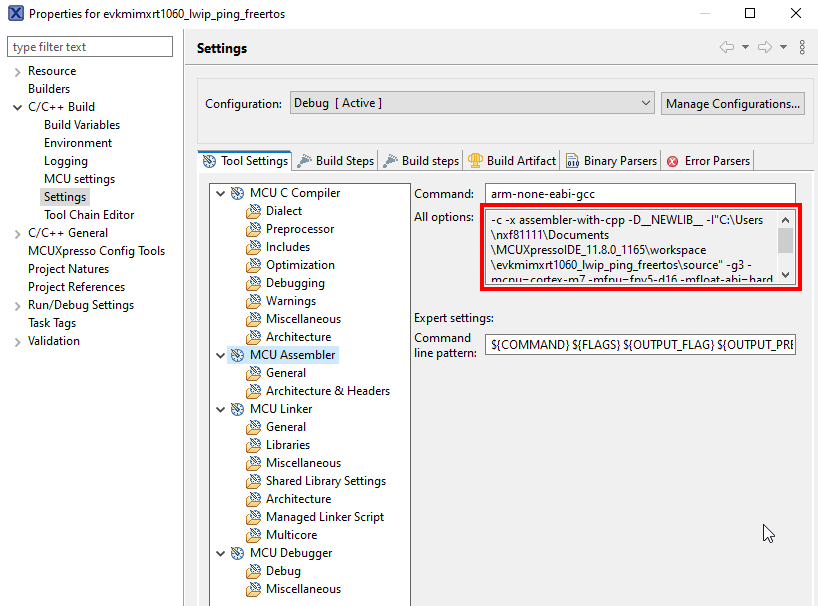

The -I include and -D symbol defines can be removed.  
The resulting Assembly options added to cDefault.yml for the example project should resemble:  
```yaml
      ASM:
        - -c 
        - -x assembler-with-cpp 
        - -g3 
        - -mcpu=cortex-m7 
        - -mfpu=fpv5-d16 
        - -mfloat-abi=hard 
        - -mthumb 
```

>__ACTION:__
>Update the cProject.yml file to include the Defined Symbols  
>Update the cDefault.yml file to include the Compiler, Assembler and Linker options

---

## 4.0 Updating the cSolution File
A cSolution project includes the **cSolution.yml** file to provide the highest level of information required for the example project(s).  
The file includes the required software packs, target-types, build-types and projects.  This allows a single project to have multiple target devices/boards.  However, the file also allows the use case where multiple related/common projects can leverage the same cSolution settings.  

### 4.1 Device and Board information
The required device and board information can be found from the existing MCUXpresso IDE eclipse project.

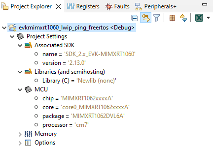

The cSolution.yml is updated to specify packs required to support the device and board:  
- Board = EVK-IMXRT1060
- Device = MIMXRT1062xxxxA

NXP provides Board Support Packs with a '_BSP' suffix.  
NXP provides Device Support Packs with a "_DFP' suffix.  
Open-CMSIS-Packs are identified with **NXP::** as the first value to indicate when NXP is the vendor of the pack. 

``` yaml
packs:
- pack: NXP::EVK-IMXRT1060_BSP
- pack: NXP::MIMXRT1062_DFP
```
### 4.2 Target, Build Types and Projects
The cSolution file also details the target and build types for the project(s).  

- **target-types** provide a unique identifier to distinguish between projects for different devices, boards and/or compilers.    This requires the target device to be listed with the package value.  This "package" value can also be found in the MCUXpresso IDE Project info.

- **build-types** are typically Debug and Release versions of the same project.  Changing the debug components and the build optimizations.  

- **projects** lists the projects for the specified targets and builds.  This is where the name of the new cProject.yml file is listed.

Adding the desired target and build types to the cSolution.yml file should resemble the following:
``` yaml
  target-types:
  - type: EVK-RT1060
    device: NXP::MIMXRT1062DVL6A
    # board: NXP::EVK-IMXRT1060
    compiler: GCC

  build-types:
  - type: debug
    debug: on       # puts compiler in -g3 mode
    optimize: none

  - type: Release 
    debug: off
    optimize: balanced

  projects:
  - project: example.cproject.yml
```
>__ACTION:__
>Update the cSolution.yml file to include the Device, Board, Target and Build information  
>Update the cSolution.yml file to include the Project(s) with the cProject.yml filename

---

## 5.0 Updating the cProject File
A cSolution project includes the **cProject.yml** file to specify the source files and software components for a given project.  

### 5.1 Adding Source Files
The MCUXpresso IDE eclipse UI clearly lists the source files required for the example.  

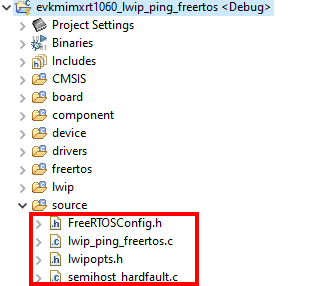

These files are delivered in the pack under the /example/source folder.  They are copied to this folder by the author of the cSolution project.

Source files are listed in the cProject.yml file under the **groups:** category.  
A group of files is given a unique name to help organize them within the project.  The name "source" is an obvious choice for this group of files.  

They are added to the cProject.yml file as follows:
```yaml 
  groups:
    - group: source
      files:
        - file: ./source/FreeRTOSConfig.h
        - file: ./source/lwip_ping_freertos.c
        - file: ./source/lwipopts.h
        - file: ./source/semihost_hardfault.h
```
The location of the source files must also be added to the cProject.yml under the **add-path:** category.  
This information is used with the Build tools to communicate locations to search for files in the project.  
```yaml
  add-path:
    - ./source
```
>__ACTION:__
>Copy the source files for the example into the /source folder in the workspace.  
>Add list of source files to cProject.yml file; Add ./source to project path

### 5.2 Adding Board Files
Board files are a required set of files that need to be added to the cProject.yml.  They are listed in MCUXpresso IDE eclipse UI under the /board folder.

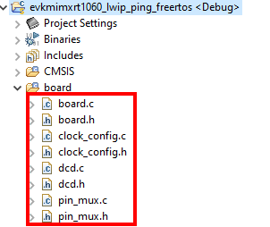

Similar to the source files, they are delivered in the pack under the /example/board folder.  They are copied to this folder by the author of the cSolution project.

The name "board" is selected to identify this group of files.  

They are added to the cProject.yml as follows:
```yaml
    - group: board
      files:
        - file: board/pin_mux.c
        - file: board/pin_mux.h
        - file: board/board.c
        - file: board/board.h
        - file: board/clock_config.c
        - file: board/clock_config.h
        - file: board/dcd.c
        - file: board/dcd.h
```
The location of the board files must also be added to the cProject.yml under the **add-path:** category.
This information is used with the Build tools to communicate locations to search for files in the project.  
```yaml
  add-path:
    - ./source
    - ./board
```
>__ACTION:__
>Copy the board files for the example into the /board folder in the workspace.
>>Add list of board files to cProject.yml file; Add ./board to project path

### 5.3 Adding Project Linker Files
A cSolution project requires linker files. The cProject.yml file identifies the linker files required for supported toolchains.  
This example needs to provide the linker files for the armgcc tools. (Default support in MCUXpresso for VS Code)  
The example can be expanded to provide support for other IDES/Compilers.  They may require different linker files to be associated to the specific tool.

These files can be found in the working Eclipse project.  They are generated when the project succesfully builds each configuration.  The linker files include a suffix to identify the build configuration. (i.e. _Debug.ld)  
They are stored in different build folders shown in the Project Explorer. (i.e. /Debug and /Release)  

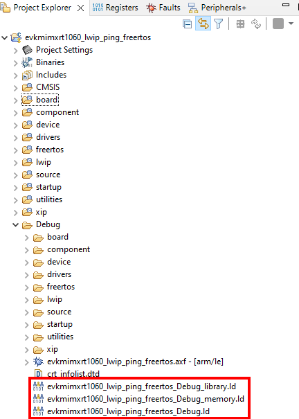  

There are three files for each build configuration that need to be copied into the pack in /example/armgcc folder.  

The primary linker file is added to the top of the cProject.yml file under the **linker:** category.
```yaml
  linker:
    - script: evkmimxrt1060_lwip_ping_freertos_Debug.ld
      for-compiler: GCC
      for-context:
        - ".debug"
    - script: evkmimxrt1060_lwip_ping_freertos_Release.ld
      for-compiler: GCC
      for-context:
        - ".Release"        
```
The location of the linker files must also be added to the cProject.yml under the **add-path:** category  
```yaml
  add-path:
    - ./source
    - ./board
    - ./armgcc    
```

A linker flag needs to be added to the cDefault.yml file to identify the folder holding these files as a library path.
The following shows how the Linker flag -L is added:  
```yaml
      Link:
        - -nostdlib     #No startup or default libs

        - -Wl,--gc-sections
        - -Wl,-print-memory-usage
        - -Wl,--sort-section=alignment
        - -L ./armgcc/ 
```
>__ACTION:__  
>Build the desired build configurations for the working project in MCUXpresso IDE to generate the linker files  
>Copy the linker files for the example into the /armgcc folder in the workspace  
>Add the linker file to cProject.yml file; Add ./armgcc to project path  
>Add the location of the linker scripts to the cDefault.yml file using Linker -L flag

### 5.4 Adding Project Specific Packs 
The cProject.yml file can include an additional list of packs.  The list can be used to include packs unique to a project or a specific version of a pack.  
For the example project, the application and title indicate some of the additional required packs.  
- **CMSIS** : The NXP microcontroller family is built on CMSIS standard products.  The CMSIS library of drivers are used by the NXP projects.  A CMSIS folder is listed in the Project Explorer view of our example project.  This pack provides those files. 
- **lwip** : lwip is an open source software.  NXP provides a pack that contains some modifications specific to NXP microcontrollers.  There is another lwip pack provided by ARM.  The author should verify that the correct lwip pack is being used to deliver the necesary files.  
- **FreeRTOS** : NXP provides a pack to support FreeRTOS kernel operations.  There are other FreeRTOS packs, so the auther must specify that the NXP pack is used.

These packs are added to the cProject.yml as follows:
```yaml
  packs:
    - pack: NXP::MIMXRT1062_DFP
    - pack: NXP::EVK-IMXRT1060_BSP
    - pack: ARM::CMSIS
    - pack: NXP::LWIP
    - pack: NXP::FREERTOS-KERNEL  
```
### 5.5 Adding Software Components
Adding software components is the most involved process in migrating a project to the cSolution format.  The libraries and source files must be captured by the list of software components in the cProject.yml file.  Another complexity is to verify that the correct source and version of the code is being provided by the listed pack.  
The cSolution project format requires that software components are identified by the using the following list of values:
```yaml
- component: Device:Startup&Baremetal
- component: Cclass:Cgroup:Csub&Cvariant
```
A device specific software component can be specified by using the first value **Device**.  The CMSIS tools associate the Device software components with the device defined as the cSolution target.  The Device software components are then found in the corresponding Device Family Pack (DFP).  

A generic software component can be specified by a **Cclass** and **Cgroup**.  This allows software components to be organized by a taxonomy.  This can help organize common software components.  

But how do you determine the correct values?

#### Eclipse Project Explorer
You can use the MCUXpresso IDE eclipse Project Explorer UI to identify most of the software component names.  
NXP has kept a consistent naming convention between file names and software components.  The following image shows an example of the location and a few of the component names.

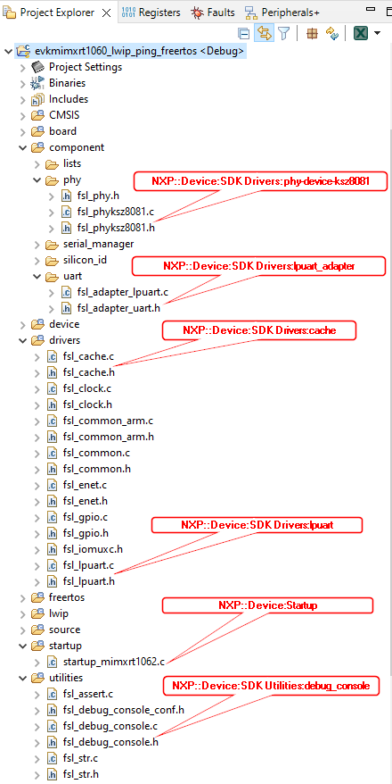

This first pass of the project helps the author add the following to the **components** list provided in the cProject.yml file.  
For this example, the list is organized by the associated folders in the MCUXpresso IDE eclipse project.
``` yaml
  components:
    - component: ARM::CMSIS:CORE@5.6.0
    - component: Device:Startup
    - component: NXP::Device:CMSIS:MIMXRT1062_system
    - component: NXP::Device:CMSIS:MIMXRT1062_header
    - component: NXP::Board Support:SDK Drivers:evkimxrt1060

    # Component
    - component: NXP::Device:SDK Drivers:lists
    - component: NXP::Device:SDK Drivers:phy-common
    - component: NXP::Device:SDK Drivers:phy-device-ksz8081 
    - component: NXP::Device:SDK Utilities:serial_manager
    - component: NXP::Device:SDK Utilities:serial_manager_uart
    - component: NXP::Device:SDK Drivers:lpuart_adapter
    # Drivers
    - component: NXP::Device:SDK Drivers:cache
    - component: NXP::Device:SDK Drivers:clock
    - component: NXP::Device:SDK Drivers:common
    - component: NXP::Device:SDK Drivers:enet
    - component: NXP::Device:SDK Drivers:gpio
    - component: NXP::Device:SDK Drivers:iomuxc
    - component: NXP::Device:SDK Drivers:lpuart
    # FreeRTOS
    - component: NXP::RTOS&FreeRTOS NXP:Core
    - component: NXP::RTOS&FreeRTOS NXP:freertos template
    - component: NXP::RTOS&FreeRTOS NXP:TAD extension
    - component: NXP::RTOS&FreeRTOS NXP:Heap&Heap_4
    # LWIP

    # Utilities
    - component: NXP::Device:SDK Utilities:assert
    - component: NXP::Device:SDK Utilities:debug_console
    - component: NXP::Device:SDK Utilities:str
```

Notice that no LWIP components are listed.  This was done to show an example where the software components can not be determined from existing information.  


#### CMSIS Toolbox Pack Tools
The CMSIS Tools provide an easy way to determine what additional components are available from the included packs.  

```yaml
C:\ csolution list components .\example.csolution.yml
```
This will provide a useful list that the author can reference when populating the necesary software components:  

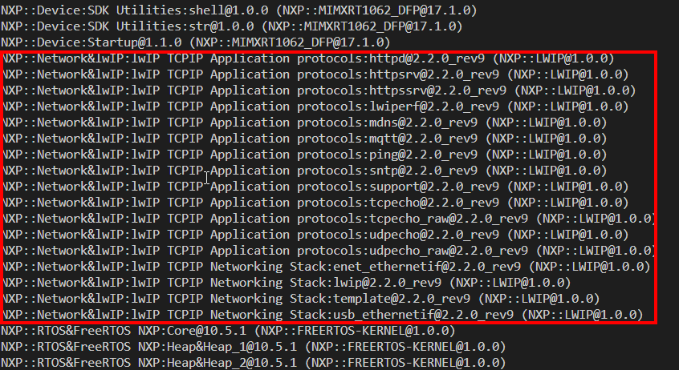

These lwip components can be added to the cProject.yml file to provide the necesary software components.  The author of the cSolution project may have knowledge of the example to exclude unnecesary/conflicting components.  

#### Resolving Pack and Component Dependencies
Once the cProject.yml file has an initial list of components, the CMSIS Toolbox cbuild command can be used to verify the correct names were used.  The tool output will also identify any co-dependencies that a component or pack may have.  These can be added to the cProject lists to eliminate the notifications.

The cProject and cSolution files need to be built using the CMSIS-Toolbox tools.  
Before the cBuild tool can work with the project, you must convert the cSolution.yml  
This generates the necesary risudual files/folders (RTE) for cBuild tools to run.
```yaml
c:\..\csolution convert example.csolution.yml
```
After this is run, the cbuild commands can be used to verify the cSolution and cProject syntax and content.
```yaml
c:\..\cbuild example.csolution.yml
```

The first error shows that "No such file or directory" exists for fsl_silicon_id.h.  
This can be used with the csolution list components to locate any missing files.

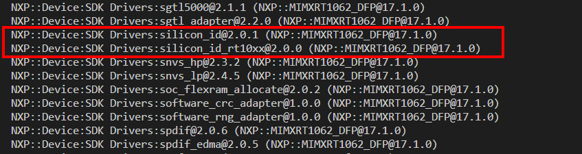

This component is added to cProject component list.  
```yaml
    - component: NXP::Device:SDK Drivers:silicon_id
    - component: NXP::Device:SDK Drivers:silicon_id_rt10xx
```
This process can be repeated until no errors are reported for missing files.

FreeRTOS Heap level must also be set by the software component.
The Heap component can be found in freertos/freertos-kernel/portable/MemMang folder in the working project.  Heap_3 is used in the working project.  This should be added to the included components
```yaml
    - component: NXP::RTOS&FreeRTOS NXP:Heap&Heap_3
```
## 6.0 Include cSolution Project in Pack
The working cSolution project can be added to a CMSIS-Pack for easy delivery to customers evaluating the included software.  
The cSolution will load an example project into the customers IDE.  The packs and code can be reviewed before the customer adds the software component to a new custom project.  
The following steps are followed to have the examples included in a pack description file (.pdsc).  

```cpp
  <examples>
    <example name="lwip_test" folder="examples/Memfault-https-cli" doc="doc/readme.txt">
      <description>Default example without Memfault additions.</description>
      <board name="EVKB-IMXRT1050" vendor="NXP" Dvendor="NXP:11"/>
      <project>
        <environment name="csolution" load="examples/Memfault-https-cli/lwip_httpscli_mbedTLS_freertos.csolution.yml"/>
      </project>
      <attributes/>
    </example>
    <example name="NXP_Ping_test" folder="examples/NXP-ping" doc="doc/readme.txt">
      <description>Default Ping example.</description>
      <board name="EVK-MIMXRT1060" vendor="NXP" Dvendor="NXP:11"/>
      <project>
        <environment name="csolution" load="examples/NXP-ping/example.csolution.yml"/>
      </project>
      <attributes/>
    </example>    
    <example name="NXP_FreeRTOS_Sem" folder="examples/NXP-freesrtos-sem" doc="doc/readme.txt">
      <description>Default FreeRTOS Sempaphore example.</description>
      <board name="EVK-MIMXRT1060" vendor="NXP" Dvendor="NXP:11"/>
      <project>
        <environment name="csolution" load="examples/NXP-freesrtos-sem/freertos-sem.csolution.yml"/>
      </project>
      <attributes/>
    </example>        
  </examples>
```

------

# Addendum to Creating cSolution Projects

## 1.0 Lock Versions of Software Components
The process described above created a cSolution project with Software Components added from CMSIS-Packs.  
CMSIS-Packs are published by the diffferent pack Vendors based on their different release schedules.  
This can cause issues with an example pulling new versions of software that introduces changes/errors.

It is ideal for an example to be delivered to the user in a tested known-good state.
cSolution allows an author to include version information to restrict what versions are used for the example.  

In [Adding Packs](#54-adding-project-specific-packs) and [Adding Components](#55-specifying-software-components-from-packs) the author can include an '@' symbol followed by the desired version of the pack or component.
```yaml
- pack: NXP::MIMXRT1062_DFP@16.0.0
- component: ARM::CMSIS:CORE@5.6.0
```
These changes will force the cBuild tool to use the specific Pack and/or component.
This can help the author control components with multiple versions.

The author can reference a working project to determine which version to select.  
The author can review the Release Notes for Versions for projects that reference other sources of the SDK software.  
The NXP DFP Pack [Version History](https://www.keil.arm.com/packs/mimxrt1062_dfp-nxp/versions/) includes the relationship in versions between the Archive SDK releases and the CMSIS-Pack releases.  

The version numbers differ:   

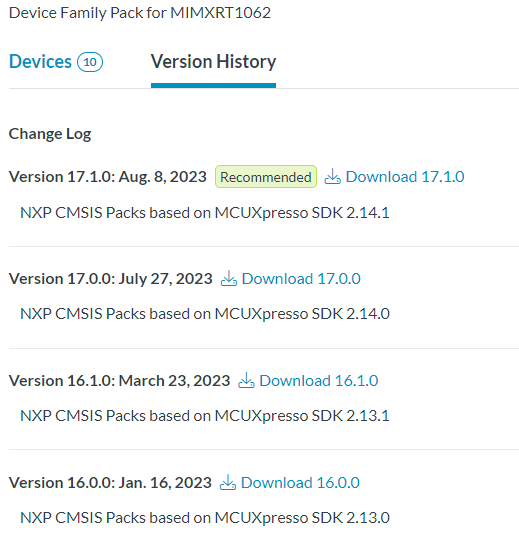  
This information allows the author to create a project that is based on v2.13.0 of the MCUXpresso SDK.  
As shown above, the author would use @16.0.0 to require the Pack based on the software included in MCUXpresso SDK v2.13.0.

## 2.0 Include Software Not Available in Packs
Some example projects will require software that cannot be included through referencing a CMSIS-Pack.  
In these cases, the source code can be included in the example folder.  

In a different example, the lwip content required an older version of the source.  This source was included by adding the code to the pack folder and including the folder in the project path.
In these cases, the files must be copied from the valid working project and placed in a folder /lwip within the pack /example/lwip.  
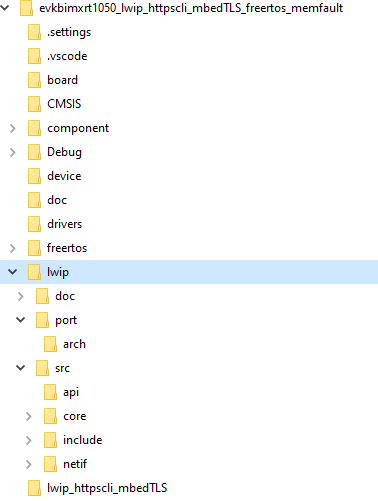

The cProject allows the build tools to search the included folder by adding to a list of paths.
```yaml
  add-path:
    - ./source
    - ./lwip/port
    - ./lwip/port/arch
    - ./lwip/src
    - ./lwip/src/include
    - ./lwip/src/include/compat
    - ./lwip/src/core
    - ./lwip/src/core/ipv6
    - ./lwip/src/include/lwip/priv
```
These files should be accesible to the user as project files.
That requires that the files be listed as source and header files under the **groups:** category.

The following is added to the cProject under the groups category to allow the required lwip files to be added as source and header files.  **lwip-src** is the selected group name chosen by the author for the associated files.
```yaml
    - group: lwip-src
      files:
        - file: ./lwip/src/api/api_lib.c
        - file: ./lwip/src/api/api_msg.c
        - file: ./lwip/src/api/err.c
        - file: ./lwip/src/api/if_api.c
        - file: ./lwip/src/api/netbuf.c
        - file: ./lwip/src/api/netdb.c
        - file: ./lwip/src/api/netifapi.c
        - file: ./lwip/src/api/sockets.c
        - file: ./lwip/src/api/tcpip.c

        - file: ./lwip/src/core/altcp_alloc.c
        - file: ./lwip/src/core/altcp_tcp.c
        - file: ./lwip/src/core/altcp.c
        - file: ./lwip/src/core/def.c
        - file: ./lwip/src/core/dns.c
        - file: ./lwip/src/core/inet_chksum.c
        - file: ./lwip/src/core/init.c
        - file: ./lwip/src/core/ip.c
        - file: ./lwip/src/core/mem.c
        - file: ./lwip/src/core/memp.c
        - file: ./lwip/src/core/netif.c
        - file: ./lwip/src/core/pbuf.c
        - file: ./lwip/src/core/raw.c
        - file: ./lwip/src/core/stats.c
        - file: ./lwip/src/core/sys.c
        - file: ./lwip/src/core/tcp_in.c
        - file: ./lwip/src/core/tcp_out.c
        - file: ./lwip/src/core/tcp.c
        - file: ./lwip/src/core/timeouts.c
        - file: ./lwip/src/core/udp.c

        - file: ./lwip/src/core/ipv4/acd.c
        - file: ./lwip/src/core/ipv4/autoip.c
        - file: ./lwip/src/core/ipv4/dhcp.c
        - file: ./lwip/src/core/ipv4/etharp.c
        - file: ./lwip/src/core/ipv4/icmp.c
        - file: ./lwip/src/core/ipv4/igmp.c
        - file: ./lwip/src/core/ipv4/ip4_addr.c
        - file: ./lwip/src/core/ipv4/ip4_frag.c
        - file: ./lwip/src/core/ipv4/ip4.c

        - file: ./lwip/src/core/ipv6/dhcp6.c
        - file: ./lwip/src/core/ipv6/ethip6.c
        - file: ./lwip/src/core/ipv6/icmp6.c
        - file: ./lwip/src/core/ipv6/inet6.c
        - file: ./lwip/src/core/ipv6/ip6_addr.c
        - file: ./lwip/src/core/ipv6/ip6_frag.c
        - file: ./lwip/src/core/ipv6/ip6.c
        - file: ./lwip/src/core/ipv6/mld6.c
        - file: ./lwip/src/core/ipv6/nd6.c

        - file: ./lwip/src/netif/ppp/auth.c
        - file: ./lwip/src/netif/ppp/ccp.c
        - file: ./lwip/src/netif/ppp/chap-md5.c
        - file: ./lwip/src/netif/ppp/chap_ms.c
        - file: ./lwip/src/netif/ppp/demand.c
        - file: ./lwip/src/netif/ppp/eap.c
        - file: ./lwip/src/netif/ppp/eui64.c
        - file: ./lwip/src/netif/ppp/fsm.c
        - file: ./lwip/src/netif/ppp/ipcp.c
        - file: ./lwip/src/netif/ppp/ipv6cp.c
        - file: ./lwip/src/netif/ppp/lcp.c
        - file: ./lwip/src/netif/ppp/lwip_ecp.c
        - file: ./lwip/src/netif/ppp/magic.c
        - file: ./lwip/src/netif/ppp/mppe.c
        - file: ./lwip/src/netif/ppp/multilink.c
        - file: ./lwip/src/netif/ppp/ppp.c
        - file: ./lwip/src/netif/ppp/pppapi.c
        - file: ./lwip/src/netif/ppp/pppcrypt.c
        - file: ./lwip/src/netif/ppp/pppoe.c
        - file: ./lwip/src/netif/ppp/pppol2tp.c
        - file: ./lwip/src/netif/ppp/pppos.c
        - file: ./lwip/src/netif/ppp/upap.c
        - file: ./lwip/src/netif/ppp/utils.c
        - file: ./lwip/src/netif/ppp/vj.c

        - file: ./lwip/src/netif/bridgeif.c
        - file: ./lwip/src/netif/bridgeif_fdb.c
        - file: ./lwip/src/netif/ethernet.c
        - file: ./lwip/src/netif/lowpan6.c
        - file: ./lwip/src/netif/lowpan6_ble.c
        - file: ./lwip/src/netif/lowpan6_common.c
        - file: ./lwip/src/netif/slipif.c
        - file: ./lwip/src/netif/zepif.c

        - file: ./lwip/port/enet_ethernetif.c
        - file: ./lwip/port/enet_ethernetif_kinetis.c
        - file: ./lwip/port/sys_arch.c
  ```
The author is able to add non-pack software to a project by copying the required source files into a folder, adding the folders to the path, and listing the necesary files.